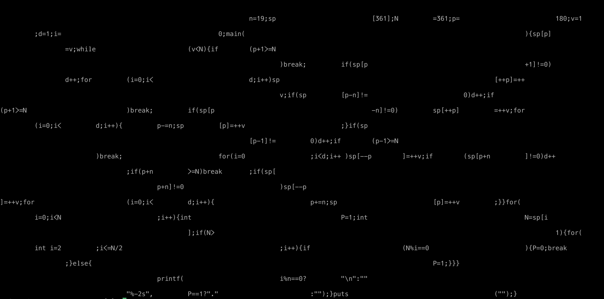

# ulam spiral as code

```
# ulam.c; generated by ulam.py 19;
# ulam.py 19 > ulam.c
# clang -o ulam ulam.c; ./ulam
              .       .   .       .
.           .                   .
  .       .   .
                .   .           .
  .   .       .               .
                .   .       .
      .   .           .   .   .
.   .   .   .       .
              .   .   .
    .       .   . . .   .   .   .
      .   .   .
        .       .
      .   .       .       .   .
.       .           .           .
          .                       .
.   .           .       .       .
  .                       .
        .       .   .
      .   .       .           .
```


